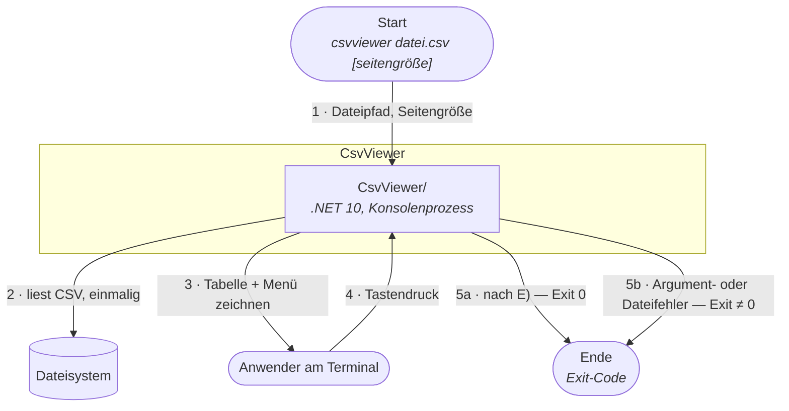
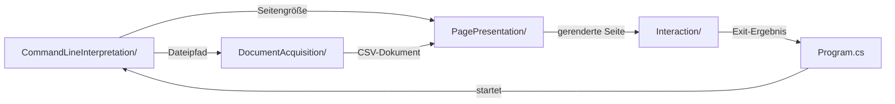

# Architektur-Karte — CsvViewer

> **Generiert.** Diese Datei ist eine Projektion des Architektur-Modells unter
> `Dokumentation/Architektur/` und wird von `/architektur karte` neu geschrieben.
> Änderungen hier gehen verloren — pflege stattdessen den jeweiligen Baustein.

## Vogelperspektive

CsvViewer zeigt eine semikolon-getrennte CSV-Datei seitenweise als ausgerichtete Texttabelle im Terminal an. Der Anwender übergibt beim Start einen Dateipfad und optional eine Seitengröße und blättert dann mit einzelnen Tastendrücken durch die Datensätze.

Das System ist ein einzelner Konsolenprozess ohne Netzwerk, ohne Datenbank und ohne Konfigurationsdatei. Die einzige externe Ressource ist die CSV-Datei selbst, die einzige Schnittstelle nach außen das Terminal.

Innen ist es nach Wirkungsart geschichtet: reine Operationen rechnen, Adapter berühren die Außenwelt, und ein Composition Root verdrahtet beides. Fehler wandern als `Result`-Objekte nach oben statt als Exceptions — nur `Program` übersetzt sie in Exit-Codes.

14 Bausteine, 4 Ebenen. Der Linktitel ist der Name im Code, die Folgezeile nennt die fachliche Bezeichnung.

## 1. `CsvViewer/`

CsvViewer CLI — Stellt den CSV-Viewer als einzeln startbaren Konsolenprozess bereit.

Der Schnitt folgt dem Weg der Daten: erst verstehen was verlangt wurde, dann das Dokument beschaffen, daraus Seiten formen und den Anwender blättern lassen. Die Verdrahtung steht bewusst daneben statt darüber.

Besteht aus:

- **1.1** [`CommandLineInterpretation/`](Dokumentation/Architektur/A00007-kommandozeilen-interpretation.md)
  Kommandozeilen-Interpretation — Übersetzt die Prozessargumente in validierte Viewer-Parameter.
- **1.2** [`DocumentAcquisition/`](Dokumentation/Architektur/A00003-dokument-beschaffung.md)
  Dokument-Beschaffung — Macht aus einem Dateipfad ein geprüftes CSV-Dokument.
- **1.3** [`PagePresentation/`](Dokumentation/Architektur/A00004-seiten-darstellung.md)
  Seiten-Darstellung — Macht aus einem CSV-Dokument die sichtbare Seitenansicht.
- **1.4** [`Interaction/`](Dokumentation/Architektur/A00005-bedienung.md)
  Bedienung — Lässt den Anwender durch die Seiten blättern.
- **1.5** [`Program.cs`](Dokumentation/Architektur/A00006-komposition.md)
  Komposition — Verdrahtet die Komponenten zu einem lauffähigen Programm.

Die Kommandozeilen-Interpretation steht **vor** der Dokument-Beschaffung, nicht in ihr: Sie liefert zwei Werte, die auseinanderlaufen — der Dateipfad speist **1.2**, die Seitengröße **1.3**.

## 1.2 `DocumentAcquisition/`

Dokument-Beschaffung — Macht aus einem Dateipfad ein geprüftes CSV-Dokument.

Datei-Zugriff und Interpretation sind bewusst getrennt: Der eine kennt kein CSV, der andere kein Dateisystem. Dadurch ist das Lesen formatunabhängig wiederverwendbar und das Parsen ohne Datei testbar.

Besteht aus:

- **1.2.1** [`FileReader`](Dokumentation/Architektur/A00008-datei-zugriff.md)
  Datei-Zugriff — Liest eine Textdatei zeilenweise als UTF-8 von der Platte.
- **1.2.2** [`CsvParser`](Dokumentation/Architektur/A00009-csv-interpretation.md)
  CSV-Interpretation — Interpretiert Textzeilen als Kopfzeile mit zugehörigen Datensätzen.

## 1.3 `PagePresentation/`

Seiten-Darstellung — Macht aus einem CSV-Dokument die sichtbare Seitenansicht.

Zwei Schritte zu verschiedenen Zeitpunkten: Die Aufteilung läuft einmalig beim Start, das Rendering bei jedem Zeichenvorgang erneut — deshalb kann dieselbe Spalte auf verschiedenen Seiten unterschiedlich breit sein.

Besteht aus:

- **1.3.1** [`Paginator`](Dokumentation/Architektur/A00010-seiten-aufteilung.md)
  Seiten-Aufteilung — Zerlegt die Datensätze eines CSV-Dokuments in Seiten fester Größe.
- **1.3.2** [`TableRenderer`](Dokumentation/Architektur/A00011-tabellen-rendering.md)
  Tabellen-Rendering — Formt eine Seite in eine ausgerichtete Texttabelle.

## 1.4 `Interaction/`

Bedienung — Lässt den Anwender durch die Seiten blättern.

Der Ablauf liegt in der Geschäftslogik, nicht im Entry Point — nur so ist der Zyklus mit einer Test-Konsole ohne echtes Terminal prüfbar. Die echte Konsole erreicht ihn ausschließlich über den Vertrag `IConsole`.

Besteht aus:

- **1.4.1** [`PageNavigator`](Dokumentation/Architektur/A00012-navigations-steuerung.md)
  Navigations-Steuerung — Bestimmt aus einem Tastendruck den nächsten Seitenindex.
- **1.4.2** [`InteractiveViewer`](Dokumentation/Architektur/A00013-viewer-ablauf.md)
  Viewer-Ablauf — Hält den interaktiven Zyklus am Laufen, bis der Anwender beendet.
- **1.4.3** [`SystemConsole`](Dokumentation/Architektur/A00014-konsolen-anbindung.md)
  Konsolen-Anbindung — Verbindet den Viewer mit dem echten Terminal.

## Kontext

Der Viewer ist kein Dienst, der auf Anfragen wartet, sondern ein Programm mit Anfang und Ende. Deshalb sind Start und Ende eigene Ereignisse — dazwischen liegt ein Zyklus, der beliebig oft durchlaufen wird oder gar nicht.



Schritt 3 und 4 bilden den Zyklus: Nach jedem Tastendruck wird die Konsole geleert und neu gezeichnet. Bei **5b** wird er nie betreten — ungültige Argumente oder eine fehlerhafte Datei beenden das Programm, bevor die erste Tabelle erscheint.

## Datenfluss



## Ordner ohne Baustein

Zwei Ordner in `CsvViewer.BL/` entsprechen bewusst keinem Baustein:

| Ordner | Warum |
|---|---|
| `HostContracts/` | Bündelt die Verträge, die der Host erfüllt (`IConsole`, `IFileReader`, `ILogger`) — eine Ablage nach Wirkungsart. Fachlich gehört `IFileReader` zu **1.2.1**, `IConsole` zu **1.4.3** |
| `Common/` | Enthält mit `Result` eine Regel statt einer Verantwortung |

## Reifegrad

| Ebene | Bausteine | davon code | dialog | vermutung |
|---|---|---|---|---|
| System | 1 | 1 | 0 | 0 |
| Container | 1 | 1 | 0 | 0 |
| Komponente | 12 | 12 | 0 | 0 |

```
Ohne eigenen Abschnitt: 1.1, 1.5 und alle Blätter — bewusst, dort ist die Substanz erschöpft
Offene Fragen gesamt: 3  (A00001: 1, A00002: 2)
Bausteine ohne Quellen: keine
Quellen-Pfade, die nicht mehr existieren: keine
```
