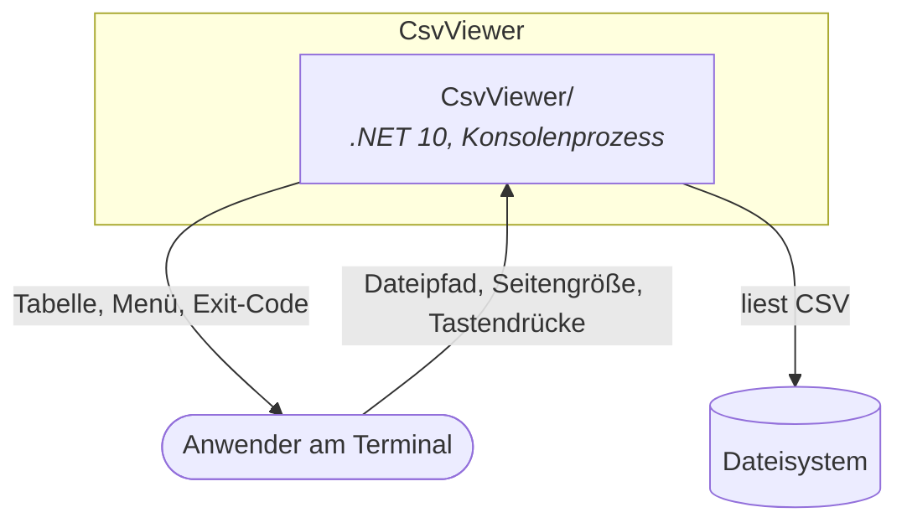
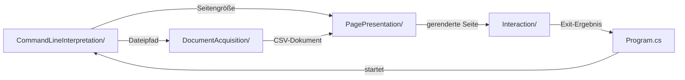

# Architektur-Karte — CsvViewer

> **Generiert.** Diese Datei ist eine Projektion des Architektur-Modells unter
> `Dokumentation/Architektur/` und wird von `/architektur karte` neu geschrieben.
> Änderungen hier gehen verloren — pflege stattdessen den jeweiligen Baustein.

14 Bausteine, 4 Ebenen. Der Linktitel ist der Name im Code, die Folgezeile nennt die fachliche Bezeichnung.

## Ebene 1 — Das Ganze

CsvViewer zeigt eine semikolon-getrennte CSV-Datei seitenweise als ausgerichtete Texttabelle im Terminal an.

Es besteht aus einem Container:

- **1** [`CsvViewer/`](Dokumentation/Architektur/A00002-csvviewer-cli.md)
  CsvViewer CLI — Stellt den CSV-Viewer als einzeln startbaren Konsolenprozess bereit.

## Ebene 2 — Eine Stufe tiefer

- **1** [`CsvViewer/`](Dokumentation/Architektur/A00002-csvviewer-cli.md)
  CsvViewer CLI — Stellt den CSV-Viewer als einzeln startbaren Konsolenprozess bereit.
  - **1.1** [`CommandLineInterpretation/`](Dokumentation/Architektur/A00007-kommandozeilen-interpretation.md)
    Kommandozeilen-Interpretation — Übersetzt die Prozessargumente in validierte Viewer-Parameter.
  - **1.2** [`DocumentAcquisition/`](Dokumentation/Architektur/A00003-dokument-beschaffung.md)
    Dokument-Beschaffung — Macht aus einem Dateipfad ein geprüftes CSV-Dokument.
  - **1.3** [`PagePresentation/`](Dokumentation/Architektur/A00004-seiten-darstellung.md)
    Seiten-Darstellung — Macht aus einem CSV-Dokument die sichtbare Seitenansicht.
  - **1.4** [`Interaction/`](Dokumentation/Architektur/A00005-bedienung.md)
    Bedienung — Lässt den Anwender durch die Seiten blättern.
  - **1.5** [`Program.cs`](Dokumentation/Architektur/A00006-komposition.md)
    Komposition — Verdrahtet die Komponenten zu einem lauffähigen Programm.

## Ebene 3 — Vollständig

- **1** [`CsvViewer/`](Dokumentation/Architektur/A00002-csvviewer-cli.md)
  CsvViewer CLI — Stellt den CSV-Viewer als einzeln startbaren Konsolenprozess bereit.
  - **1.1** [`CommandLineInterpretation/`](Dokumentation/Architektur/A00007-kommandozeilen-interpretation.md)
    Kommandozeilen-Interpretation — Übersetzt die Prozessargumente in validierte Viewer-Parameter.
  - **1.2** [`DocumentAcquisition/`](Dokumentation/Architektur/A00003-dokument-beschaffung.md)
    Dokument-Beschaffung — Macht aus einem Dateipfad ein geprüftes CSV-Dokument.
    - **1.2.1** [`FileReader`](Dokumentation/Architektur/A00008-datei-zugriff.md)
      Datei-Zugriff — Liest eine Textdatei zeilenweise als UTF-8 von der Platte.
    - **1.2.2** [`CsvParser`](Dokumentation/Architektur/A00009-csv-interpretation.md)
      CSV-Interpretation — Interpretiert Textzeilen als Kopfzeile mit zugehörigen Datensätzen.
  - **1.3** [`PagePresentation/`](Dokumentation/Architektur/A00004-seiten-darstellung.md)
    Seiten-Darstellung — Macht aus einem CSV-Dokument die sichtbare Seitenansicht.
    - **1.3.1** [`Paginator`](Dokumentation/Architektur/A00010-seiten-aufteilung.md)
      Seiten-Aufteilung — Zerlegt die Datensätze eines CSV-Dokuments in Seiten fester Größe.
    - **1.3.2** [`TableRenderer`](Dokumentation/Architektur/A00011-tabellen-rendering.md)
      Tabellen-Rendering — Formt eine Seite in eine ausgerichtete Texttabelle.
  - **1.4** [`Interaction/`](Dokumentation/Architektur/A00005-bedienung.md)
    Bedienung — Lässt den Anwender durch die Seiten blättern.
    - **1.4.1** [`PageNavigator`](Dokumentation/Architektur/A00012-navigations-steuerung.md)
      Navigations-Steuerung — Bestimmt aus einem Tastendruck den nächsten Seitenindex.
    - **1.4.2** [`InteractiveViewer`](Dokumentation/Architektur/A00013-viewer-ablauf.md)
      Viewer-Ablauf — Hält den interaktiven Zyklus am Laufen, bis der Anwender beendet.
    - **1.4.3** [`SystemConsole`](Dokumentation/Architektur/A00014-konsolen-anbindung.md)
      Konsolen-Anbindung — Verbindet den Viewer mit dem echten Terminal.
  - **1.5** [`Program.cs`](Dokumentation/Architektur/A00006-komposition.md)
    Komposition — Verdrahtet die Komponenten zu einem lauffähigen Programm.

## Kontext



## Komponenten von CsvViewer/



## Ordner ohne Baustein

Zwei Ordner in `CsvViewer.BL/` entsprechen bewusst keinem Baustein:

| Ordner | Warum |
|---|---|
| `HostContracts/` | Bündelt die Verträge, die der Host erfüllt (`IConsole`, `IFileReader`, `ILogger`) — eine Ablage nach Wirkungsart. Fachlich gehört `IFileReader` zu **1.2.1**, `IConsole` zu **1.4.3** |
| `Common/` | Enthält mit `Result` eine Regel statt einer Verantwortung |

## Reifegrad

| Ebene | Bausteine | davon code | dialog | vermutung |
|---|---|---|---|---|
| System | 1 | 1 | 0 | 0 |
| Container | 1 | 1 | 0 | 0 |
| Komponente | 12 | 12 | 0 | 0 |

```
Unverfeinerte Bausteine: 1.1, 1.5 und alle Blätter — bewusst, dort ist die Substanz erschöpft
Offene Fragen gesamt: 3  (A00001: 1, A00002: 2)
Bausteine ohne Quellen: keine
Quellen-Pfade, die nicht mehr existieren: keine
```
