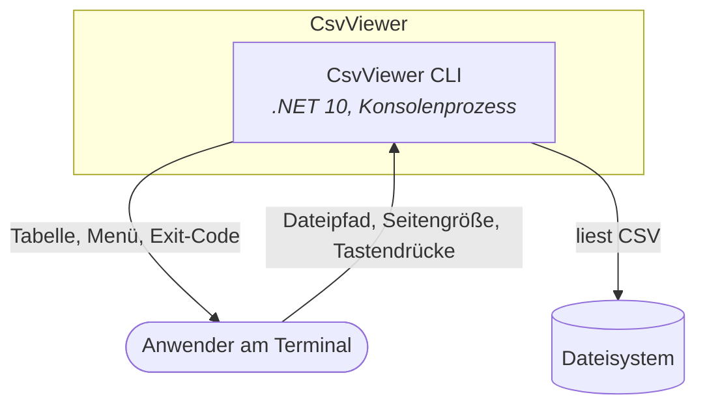
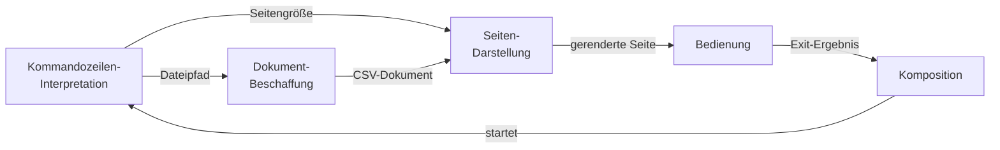

# Architektur-Karte — CsvViewer

> **Generiert.** Diese Datei ist eine Projektion des Architektur-Modells unter
> `Dokumentation/Architektur/` und wird von `/architektur karte` neu geschrieben.
> Änderungen hier gehen verloren — pflege stattdessen den jeweiligen Baustein.

14 Bausteine, 4 Ebenen.

## Ebene 1 — Das Ganze

CsvViewer zeigt eine semikolon-getrennte CSV-Datei seitenweise als ausgerichtete Texttabelle im Terminal an.

Es besteht aus einem Container:

- **1** [CsvViewer CLI](Dokumentation/Architektur/A00002-csvviewer-cli.md) — Stellt den CSV-Viewer als einzeln startbaren Konsolenprozess bereit.

## Ebene 2 — Eine Stufe tiefer

- **1** [CsvViewer CLI](Dokumentation/Architektur/A00002-csvviewer-cli.md) — Stellt den CSV-Viewer als einzeln startbaren Konsolenprozess bereit.
  - **1.1** [Kommandozeilen-Interpretation](Dokumentation/Architektur/A00007-kommandozeilen-interpretation.md) — Übersetzt die Prozessargumente in validierte Viewer-Parameter.
  - **1.2** [Dokument-Beschaffung](Dokumentation/Architektur/A00003-dokument-beschaffung.md) — Macht aus einem Dateipfad ein geprüftes CSV-Dokument.
  - **1.3** [Seiten-Darstellung](Dokumentation/Architektur/A00004-seiten-darstellung.md) — Macht aus einem CSV-Dokument die sichtbare Seitenansicht.
  - **1.4** [Bedienung](Dokumentation/Architektur/A00005-bedienung.md) — Lässt den Anwender durch die Seiten blättern.
  - **1.5** [Komposition](Dokumentation/Architektur/A00006-komposition.md) — Verdrahtet die Komponenten zu einem lauffähigen Programm.

## Ebene 3 — Vollständig

- **1** [CsvViewer CLI](Dokumentation/Architektur/A00002-csvviewer-cli.md) — Stellt den CSV-Viewer als einzeln startbaren Konsolenprozess bereit.
  - **1.1** [Kommandozeilen-Interpretation](Dokumentation/Architektur/A00007-kommandozeilen-interpretation.md) — Übersetzt die Prozessargumente in validierte Viewer-Parameter.
  - **1.2** [Dokument-Beschaffung](Dokumentation/Architektur/A00003-dokument-beschaffung.md) — Macht aus einem Dateipfad ein geprüftes CSV-Dokument.
    - **1.2.1** [Datei-Zugriff](Dokumentation/Architektur/A00008-datei-zugriff.md) — Liest eine Textdatei zeilenweise als UTF-8 von der Platte.
    - **1.2.2** [CSV-Interpretation](Dokumentation/Architektur/A00009-csv-interpretation.md) — Interpretiert Textzeilen als Kopfzeile mit zugehörigen Datensätzen.
  - **1.3** [Seiten-Darstellung](Dokumentation/Architektur/A00004-seiten-darstellung.md) — Macht aus einem CSV-Dokument die sichtbare Seitenansicht.
    - **1.3.1** [Seiten-Aufteilung](Dokumentation/Architektur/A00010-seiten-aufteilung.md) — Zerlegt die Datensätze eines CSV-Dokuments in Seiten fester Größe.
    - **1.3.2** [Tabellen-Rendering](Dokumentation/Architektur/A00011-tabellen-rendering.md) — Formt eine Seite in eine ausgerichtete Texttabelle.
  - **1.4** [Bedienung](Dokumentation/Architektur/A00005-bedienung.md) — Lässt den Anwender durch die Seiten blättern.
    - **1.4.1** [Navigations-Steuerung](Dokumentation/Architektur/A00012-navigations-steuerung.md) — Bestimmt aus einem Tastendruck den nächsten Seitenindex.
    - **1.4.2** [Viewer-Ablauf](Dokumentation/Architektur/A00013-viewer-ablauf.md) — Hält den interaktiven Zyklus am Laufen, bis der Anwender beendet.
    - **1.4.3** [Konsolen-Anbindung](Dokumentation/Architektur/A00014-konsolen-anbindung.md) — Verbindet den Viewer mit dem echten Terminal.
  - **1.5** [Komposition](Dokumentation/Architektur/A00006-komposition.md) — Verdrahtet die Komponenten zu einem lauffähigen Programm.

## Kontext



## Komponenten von CsvViewer CLI



## Ordner-Zuordnung

| Baustein | Ordner |
|---|---|
| Kommandozeilen-Interpretation | `CsvViewer.BL/CommandLineInterpretation/` |
| Dokument-Beschaffung | `CsvViewer.BL/DocumentAcquisition/` |
| Seiten-Darstellung | `CsvViewer.BL/PagePresentation/` |
| Bedienung | `CsvViewer.BL/Interaction/` |
| Komposition | `CsvViewer/Program.cs` |

Zwei Ordner entsprechen bewusst keinem Baustein: `HostContracts/` bündelt die Verträge, die der Host erfüllt, und `Common/` enthält mit `Result` eine Regel statt einer Verantwortung.

## Reifegrad

| Ebene | Bausteine | davon code | dialog | vermutung |
|---|---|---|---|---|
| System | 1 | 1 | 0 | 0 |
| Container | 1 | 1 | 0 | 0 |
| Komponente | 12 | 12 | 0 | 0 |

```
Unverfeinerte Bausteine: 1.1, 1.5 und alle Blätter — bewusst, dort ist die Substanz erschöpft
Offene Fragen gesamt: 3  (A00001: 1, A00002: 2)
Bausteine ohne Quellen: keine
Quellen-Pfade, die nicht mehr existieren: keine
```
